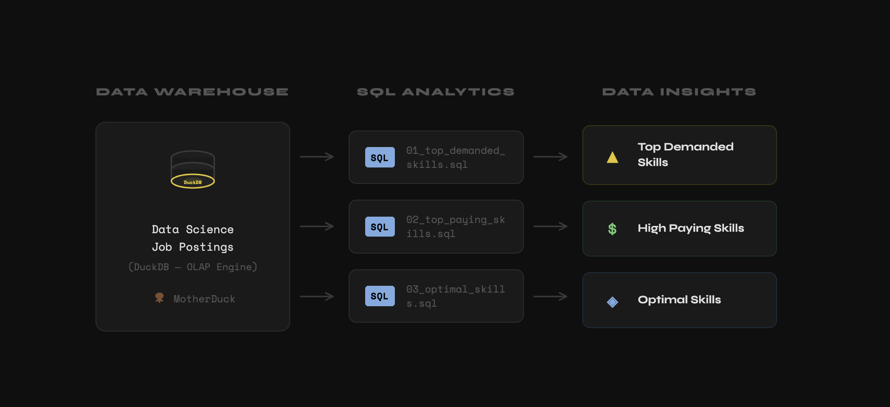
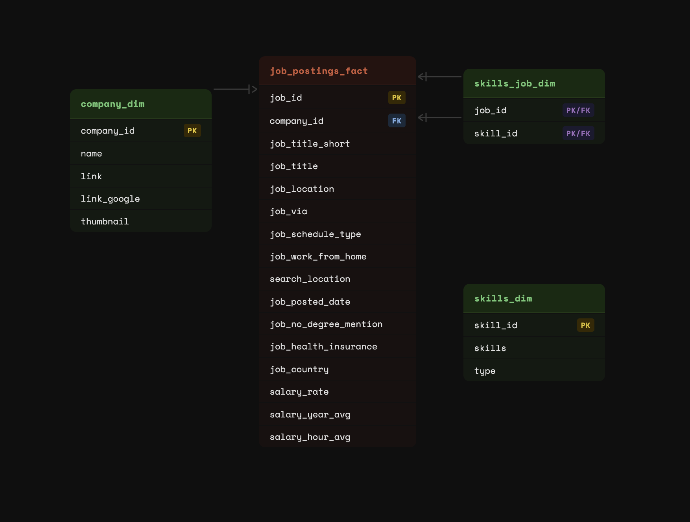

# Exploratory Data Analysis w/ SQL: Scandinavian Job Market Analytics
A SQL project analyzing the Scandinavin (Danish, Swedish, Norwegian, Finnish) data engineer job market using real world job posting data. It demonstrates my ability to write **production-quality analytical SQL, design efficient queries, and turn business questions into data-driven insights.**
## Executive Summary
- **Project scope**: Built 3 analytical queries that answer key questions about the Scandinavian data engineer job market
- **Data modeling**: Used multi-table joins across fact and dimension tables to extract insights
- **Analytics**: Applied aggregations, filtering, and sorting to find top skills by demand, salary, and overall value
- **Outcome**: Delivered actionable insights on SQL/Python dominance, cloud trends, and salary patterns
## Quick Visual Summary
HTML / Github

## Problem & Context
Job market analysts need to answer questions like:

- *Which skills are most in-demand for data engineers?*
- *Which skills command the highest salaries?*
- *What is the optimal skill set balancing demand and compensation?*

This project analyzes a data warehouse built using a star schema design. The warehouse structure consists of:

## SQL Skills Demonstrated
### Query Design & Optimization
- **Complex Joins**: Multi-table 'INNER JOIN' operations across 'job_postings_fact', 'skills_job_dim', and 'skills_dim'
- **Aggregations**: 'COUNT()', 'MEDIAN()', 'ROUND()' for statistical analysis
- **Filtering**: Boolean logic with 'WHERE' clauses and multiple conditions ('job_title_short', 'salary_year_avg' 'IS NOT NULL')
- **Sorting & Limiting**: 'ORDER BY' with 'DESC' and 'LIMIT' for top-N analysis

### Data Analysis Techniques
- **Grouping**: 'GROUP BY' for categorical analysis by skill
- **Mathematical Functions**: 'LN()' for natural logarithm transformation to normalize demand metrics
- **Calculated Metrics**: Derived optimal score combining log-transformed demand with median salary
- **HAVING Clause**: Filtering aggregated results (skills with >= 100 postings)
- **NULL Handling**: Proper filtering of incomplete records ('salary_year_avg IS NOT NULL')